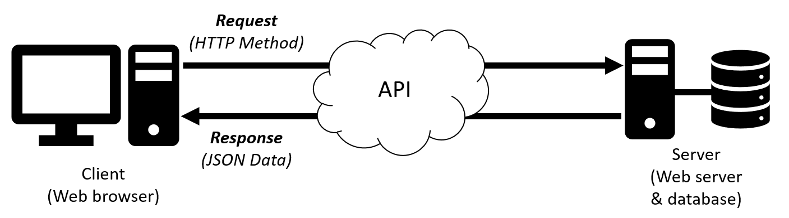
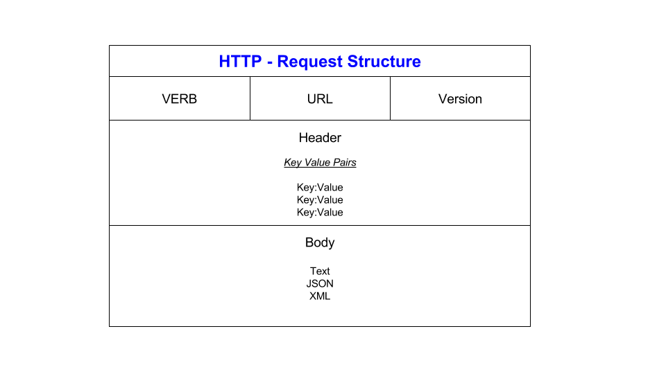
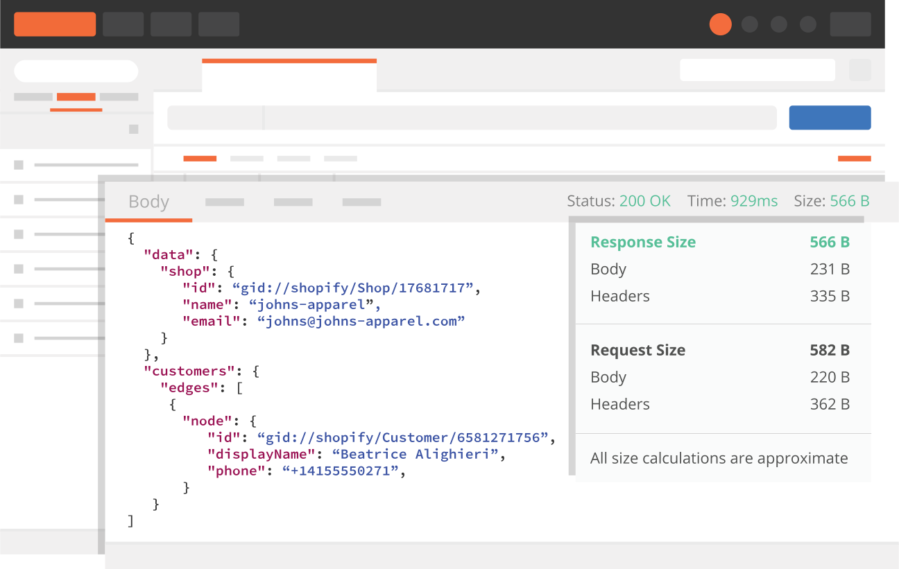

# APIs

## What is an API?

### API - Application Programming Interface

A way to transfer data from a separate server or service (independent of the languages involved). They act as a middle-man between the client and server.

APIs are used to bring applications together to perform a function built upon data sharing and executing processes, leveraging existing code to speed up development time.



## Why are APIs so popular?

In the 1990s, APIs started growing in popularity and now are widespread in their use. They allow developers to build new programmatic interactions between the various applications which people and businesses use on a daily basis.

## What is REST API?

### REST - REpresentational State Transfer

REST APIs are lightweight, maintainable, scalable.

## What makes an API RESTful?

- Representational data flow
- Messages
- Unique URIs/naming
- Statelessness
- Caching

### What is Statelessness?

Statelessness is when no client context (session state) is stored on the server between requests, maximising availability. Therefore, REST APIs do not rely on servers remembering previous requests and so API calls can be made independently of one another.

### What is Caching?

Caching is where hardware or software stores data so that future requests for that data can be served faster. For an API to be RESTful, caching should be used where possible, and if not, the server must state if cacheable or not.

## HTTP Requests

### HTTP - HyperText Transfer Protocol

HTTP is used for encoding and transporting information and data between a client (e.g. web browser) and a server (e.g. web server hosting a website) over the Internet.

### HTTPS - HyperText Transfer Protocol Secure

HTTPS is the secure version of HTTP and ensures that requests/ data transfer is secure using the Transport Layer Security (TLS) protocol, or previously the Secure Socket Layer (SSL).

## HTTP Verbs

- GET - Request data from a destination e.g. viewing a website
- POST - Submit data to a destination e.g. submit login details
- PUT - Replaces data at a destination e.g. updating a server
- PATCH - Append data to a destination e.g. adding a server
- DELETE - Remove data from a destination e.g. remove a server

## HTTP Request Structure

HTTP Requests contain three main parts: the request line itself, the headers and the body which is optional for GET requests:

- **Request line:** VERB + URL + Version
- **Headers:** Key/value pairs describing the request, e.g. content-type, date, encoding method.
- **Body:** Optional Text, JSON, XML data sent to server



### Example Request

```http
GET http://example.com 1.1

Content-Type: application/json
Data: Tue, 15 Nov 1994 08:12:31 GMT
Accept-Charset: utf-8

***No body required in a get request in most instances***
```

## HTTP Response Structure

HTTP Responses contain three main parts: the response/ status line, the headers and the body, as shown below:

- **Response line:** Status code + HTTP version
- **Headers:** Key/value pairs describing the response similar to the request, e.g. content-type, encoding etc.
- **Body:** Text, JSON, XML containing data requested by client


### Example Response

```json
  200 v1.1
  
  Cache-Control: private, max-age=0, must-revalidate
  Connection: keep-alive
  Content-Encoding: gzip
  Content-Length: 37842
  Content-Type: text/html; charset=utf-8
  Date: Thu, 01 Jun 2017 12:01:44 GMT
  
  {
    "ID" : "1",
    "firstname" : "Joe",
    "surname" : "Bloggs",
    "email" : "joe.b@gmail.com"
  }
```

## What is Postman?

Postman is an application with a user-friendly GUI used by developers to design, build and test their APIs. It is easy to use and enables users the control of every phase of their API lifecycle through simplifying each step of the processes, helping to create better APIs faster.


*(Postman, 2023)*
